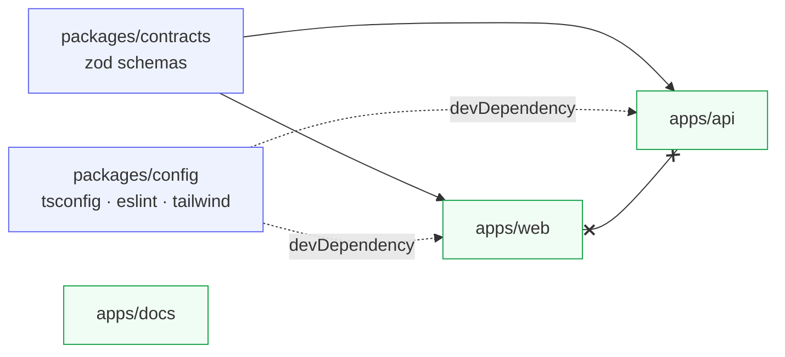

# ทัวร์โครงสร้าง repo

<Status value="implemented" />

## ผังโฟลเดอร์

```
app-platform/
├── apps/
│   ├── web/            Next.js 16 App Router — ส่วนติดต่อผู้ใช้
│   ├── api/            NestJS 11 modular monolith — REST API
│   └── docs/           VitePress — เอกสารชุดนี้
├── packages/
│   ├── contracts/      zod schema ที่ web และ api ใช้ร่วมกัน  ← หัวใจ
│   └── config/         tsconfig / eslint / prettier / tailwind theme ที่แชร์กัน
├── infra/
│   └── docker/         Dockerfile.dev ของแต่ละแอป + config ของ Traefik
├── docker-compose.yml         นิยาม service (postgres, redis, traefik, web, api, docs)
├── docker-compose.local.yml   overlay สำหรับ dev: build, bind mount, publish port
├── turbo.json                 นิยาม task ของ Turborepo
├── pnpm-workspace.yaml        ขอบเขต workspace + allowBuilds
└── .env.example               ต้นแบบของ .env
```

## ทิศทางการพึ่งพา



กฎเดียวที่ห้ามฝ่าฝืน: **`apps/web` กับ `apps/api` ห้าม import กันเอง** ของที่ต้องใช้ร่วมกันต้องไปอยู่ใน `packages/contracts` เท่านั้น — นั่นแหละคือสิ่งที่ทำให้ทั้งสองฝั่งไม่ drift จากกัน ดู [Contract-first](/conventions/contract-first)

`apps/docs` ไม่พึ่งอะไรเลยและไม่มีใครพึ่งมัน — เป็นเอกสารล้วน ไม่ใช่โค้ดที่รันจริง

## แต่ละที่คืออะไร

### `apps/web`

```
src/
├── app/
│   ├── layout.tsx          root layout (pass-through)
│   ├── providers.tsx       QueryClientProvider (client component)
│   ├── globals.css         Tailwind v4 entry + design token
│   └── [locale]/           ทุกหน้าอยู่ใต้ locale segment
├── i18n/
│   ├── routing.ts          defineRouting: locales ["en","th"]
│   ├── request.ts          โหลด messages ต่อ request
│   └── navigation.ts       Link/redirect/useRouter ที่รู้จัก locale
├── components/ui/          shadcn/ui components
├── lib/utils.ts            cn() helper
└── proxy.ts                middleware ของ Next 16 (ชื่อใหม่ของ middleware.ts)
```

::: tip `proxy.ts` ไม่ใช่ `middleware.ts`
Next.js 16 เปลี่ยนชื่อไฟล์ middleware เป็น `proxy.ts` ตอนนี้มีแค่ next-intl middleware อยู่ในนั้น การป้องกัน route จะถูกเพิ่มเข้าไปที่นี่ ดู [Session ฝั่ง client](/frontend/auth-client)
:::

### `apps/api`

```
src/
├── main.ts                 bootstrap: pino logger, ZodValidationPipe, CORS, Swagger
├── app.module.ts           รวมทุกโมดูล + ConfigModule + LoggerModule
├── health.controller.ts    GET /health
├── prisma/                 PrismaService (@Global)
├── auth/                   login / refresh / JwtStrategy / JwtAuthGuard
└── users/                  create / find
```

หนึ่งโฟลเดอร์ = หนึ่งโมดูล = หนึ่ง bounded context สื่อสารกันผ่าน service ที่ export ออกมา ไม่ใช่เรียก repository ข้ามโมดูล

### `packages/contracts`

zod schema ล้วน ไม่มีขั้นตอน build (`main` ชี้ไป `./src/index.ts` ตรง ๆ) — `apps/web` จึงต้องมี `transpilePackages: ["@app-platform/contracts"]` ใน `next.config.ts`

ของที่มีอยู่ตอนนี้: `TokenRequestSchema`, `TokenResponseSchema`, `UserSchema`, `CreateUserSchema`, `UpdateUserSchema`, `PaginationQuerySchema`, `paginatedSchema()`

### `packages/config`

config ที่แชร์กัน ป้องกันไม่ให้แต่ละแอปตั้งค่าเพี้ยนกันเอง: `tsconfig.base.json`, `eslint/{base,react,nest}.js`, `prettier.config.js`, `tailwind/theme.css`

## จะเพิ่มของ ต้องแตะตรงไหน

| อยากทำอะไร | แตะที่ไหน |
| --- | --- |
| เพิ่ม endpoint ใหม่ | schema ใน `packages/contracts` → controller/service ใน `apps/api/src/<module>/` |
| เพิ่มหน้าใหม่ | `apps/web/src/app/[locale]/<route>/page.tsx` + key ใน `apps/web/messages/{th,en}.json` |
| เพิ่ม field ในตาราง | `apps/api/prisma/schema.prisma` → `prisma:migrate` → อัปเดต schema ใน contracts |
| เพิ่ม env var | `.env.example` → schema ตรวจ env ใน api → [ตาราง env](/reference/env-vars) |
| เพิ่ม component ของ shadcn | `pnpm --filter @app-platform/web dlx shadcn@latest add <name>` |
| เพิ่มภาษา | `apps/web/src/i18n/routing.ts` + `apps/web/messages/<locale>.json` |
| เพิ่มหน้าเอกสาร | `apps/docs/<section>/<page>.md` **และ** `apps/docs/en/<section>/<page>.md` + ลงทะเบียนใน `.vitepress/structure.ts` |
| เพิ่ม service ใน stack | `docker-compose.yml` + `docker-compose.local.yml` + label ของ Traefik |

::: warning หน้าเอกสารต้องมาเป็นคู่เสมอ
`.vitepress/config.ts` ตั้ง `ignoreDeadLinks: false` ถ้าเพิ่มหน้าไทยแล้วลืมทำ `/en/` มิเรอร์ `pnpm --filter @app-platform/docs build` จะพัง — ตั้งใจให้เป็นแบบนั้น
:::

## Task ของ Turborepo

`turbo.json` นิยามไว้ 5 task

| Task | พฤติกรรม |
| --- | --- |
| `dev` | `cache: false`, `persistent: true` — รันทุกแอปพร้อมกัน |
| `build` | `dependsOn: ["^build"]`, cache `dist/**` และ `.next/**` |
| `lint` | `dependsOn: ["^build"]` |
| `test` | `dependsOn: ["^build"]` |
| `clean` | ไม่ cache |

รันทั้ง repo: `pnpm dev` / `pnpm build` / `pnpm lint` / `pnpm test`
รันเฉพาะแอป: `pnpm --filter @app-platform/api <script>`
